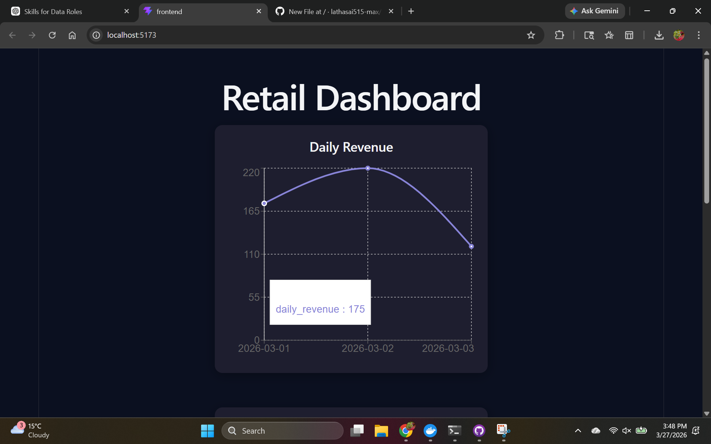
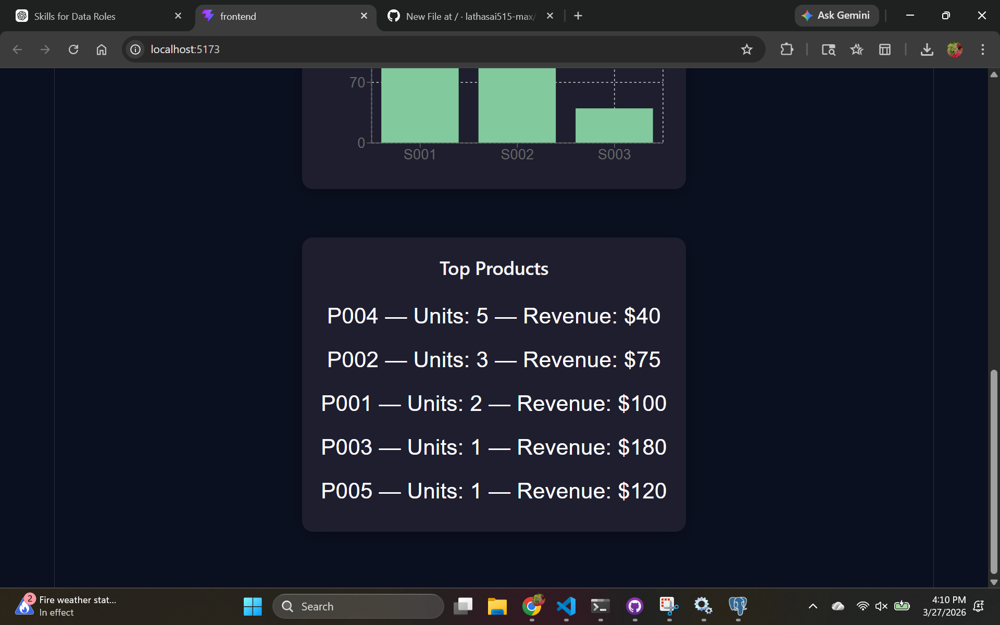
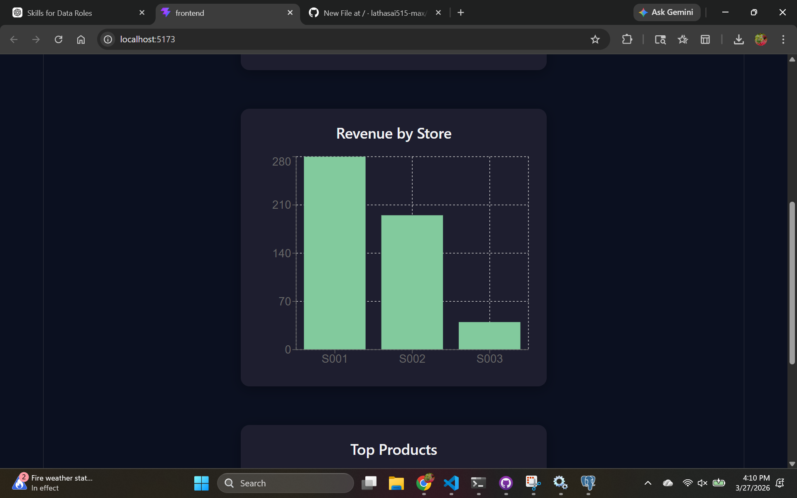

# Retail Analytics Platform

An end-to-end retail analytics application that processes transactional data, exposes KPI APIs, and visualizes insights through an interactive dashboard.

---

## Overview

This project simulates a real-world retail analytics system. It ingests raw sales data, transforms it into structured tables, computes key business metrics, and serves them via a backend API. A React-based frontend consumes these APIs to display insights with charts.

The platform is fully containerized using Docker for easy setup and deployment.

---

## Features

* Data ingestion from CSV files (sales, products, stores)
* Relational schema using PostgreSQL
* KPI APIs built with FastAPI:

  * Daily revenue
  * Top products
  * Revenue by store
* Interactive dashboard with charts (Recharts)
* Data quality checks (nulls, duplicates, invalid values)
* Automated API testing with Pytest
* Dockerized backend and frontend services

---

## Tech Stack

**Backend**

* Python
* FastAPI
* SQLAlchemy
* PostgreSQL
* Pandas

**Frontend**

* React (Vite)
* Recharts

**Dev & Ops**

* Docker
* Docker Compose
* Pytest

---

## Architecture

```
CSV Data → PostgreSQL → FastAPI → React Dashboard
```

---

## Screenshots

### Dashboard


### Daily Revenue



### Top Products



### Revenue by Store



---

## Project Structure

```
retail-analytics-platform/
├── backend/
├── frontend/
├── data/
├── tests/
├── screenshots/
├── docker-compose.yml
└── README.md
```

---

## API Endpoints

```
GET /
GET /api/kpis/daily-revenue
GET /api/kpis/top-products
GET /api/kpis/revenue-by-store
```

---

## Running the Project (Docker)

```bash
docker compose up --build
```

Frontend: http://localhost:5173
Backend: http://localhost:8000

---

## Running Without Docker

### Backend

```bash
cd backend
pip install -r requirements.txt
python -m backend.app.main
```

### Frontend

```bash
cd frontend
npm install
npm run dev
```

---

## Data Quality Checks

```bash
python -m backend.app.data_quality
```

---

## Testing

```bash
pytest
```

---

## Future Improvements

* Add authentication
* Deploy to cloud (AWS / Render / Railway)
* Add more KPIs
* Use Airflow for scheduling pipelines

---

## Author

Sailatha Sundru

